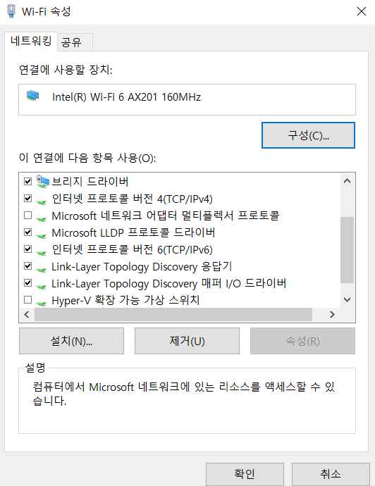
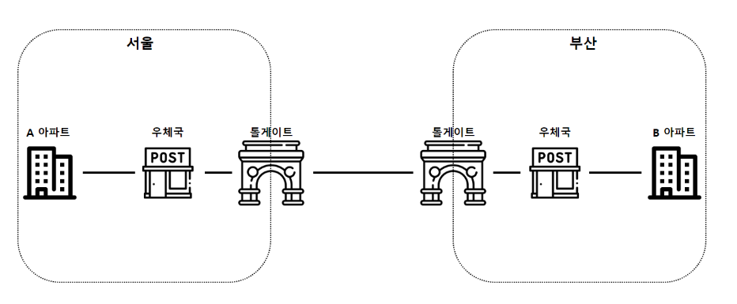
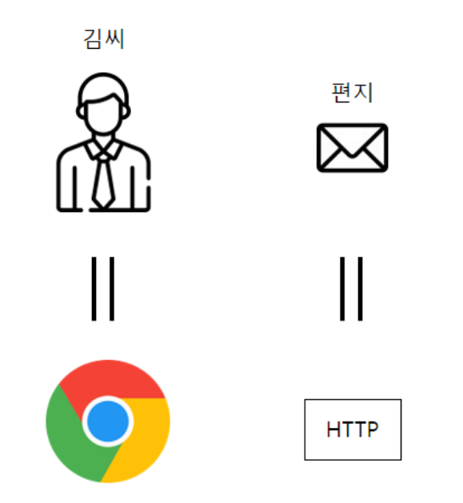
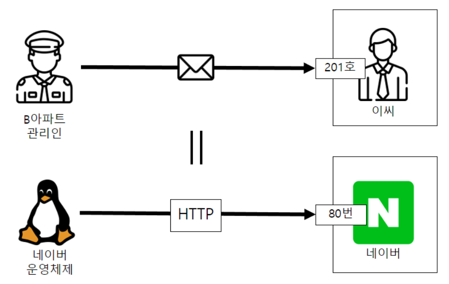

## OSI 7계층

1. 물리 - 케이블/리피터/허브
  * 데이터를 비트 단위로 전송
2. 데이터링크 - 브릿지/스위치
  * 물리에서 받은 데이터를 프레임 단위로 전송
3. 네트워크 - Router
  * 데이터를 패킷 단위로 나누어 경로 설정
4. 전송 - TCP/UDP
  * 세그먼트 단위로 나누어 TCP/UDP등으로 신뢰성 보장
5. 세션 - 응용 프로그램 관점
  * 통신 세션 유지/종료, 데이터 교환 순서 관리
6. 표현 - 인코딩/암호화
  * 데이터 인코딩/디코딩/암호화/압축, 데이터 형식 반환
7. 응용 - IO/UI
  * HTTP 등으로 사용자와 직접 상호작용

* PC방에서 게임 중 오류가 발생했다!

  * 모든 PC가 다 오류 발생 -> 라우터(3계층 네트워크) or 광랜 회선(1계층 물리)
  * 나만 문제고 소프트웨어 문제(7계층 애플리케이션)
  * 나만 문제고 소프트웨어는 문제 아님(2계층 데이터링크)

### HTTP 1.1
  * Host 항목 필수!
  * 블록 단위 인코딩

## TCP/IP 그리고 OSI

#### (Transmission Control Protocol/Internet Protocol)

* 4계층 전송 계층에 해당, 자체적으로 4계층 구조
  1. 네트워크 액세스 - OSI 2계층
  2. 인터넷 - OSI 3계층
  3. 전송
  4. 응용

* OSI는 현실적인 모델은 아님

