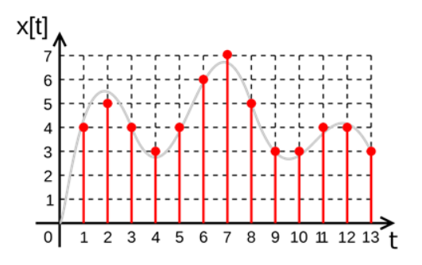
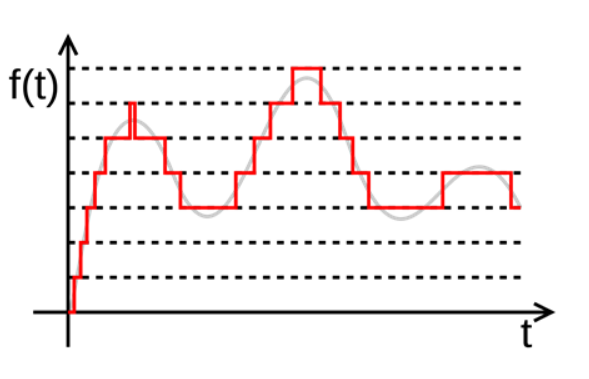
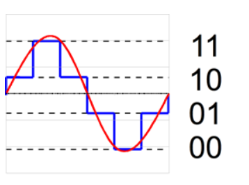
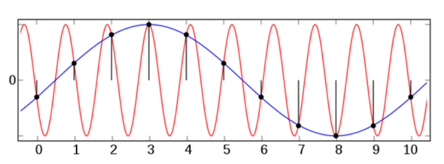

# 2. 데이터 통신

### 2-1. 아날로그와 디지털 신호
### 2-2. 비트 전송/전송 매체
### 2-3. 오류 검출 및 수정

---

## 데이터 통신의 종류

* 전기 통신(telecommunication): 먼 거리에서 행하는 통신
* 데이터(data): 사용자 간에 합의된 양식의 정보
* 데이터 통신: 통신매체를 활용해 정해진 규격(프로토콜)에 맞추어 데이터 정보 교환 과정

## 2-1. 아날로그 & 디지털 신호

* 아날로그: 전통적인 방식의 신호로 연속적인 파형, 실제 목소리와 아날로그 TV등의 신호
* 디지털: 0 혹은 1로 표시, 컴퓨터에서 사용

### 아날로그 -> 디지털 변환

1. 표본화: 일정한 간격으로 샘플링

2. 양자화: 근삿값으로 점을 찍어 계단식으로 변환

3. 부호화: 점을 바탕으로 이진수로 변환한다

### 변환 시 고려할 요소

1. 변환 속도(= 주파수 = 샘플링 속도)
2. 정확도

* 앨리어싱(Aliasing): 실제 파장과 이질적으로 변환되는 경우

---

## 2-2. 비트 전송/전송매체

* 데이터는 비트를 단위로 전송된다
* 0/1로 표기되는 이진수

### 전송 매체

* 크게 유선/무선으로 분류 가능

#### 유선 전송 매체
* 케이블/광섬유
* 데이터를 전자기파로 전달
* 기후에 영향을 받음
* 케이블 가입자만 데이터 전송 가능
* 근거리 통신에 적합

#### 무선 전송 매체
* 대기/해수 등으로 전파
* 물리적인 경로가 딱히 없음
* 지형/기후 관계 없음
* 수신 범위가 넓음
* 주파수 대역의 규제 존재
* 광대역 통신에 적합

### 테이블 요약

| **구분**                 | **유선 전송 매체**                 | **무선 전송 매체**                 |
|--------------------------|------------------------------------|------------------------------------|
| **물리적 구성**           | 케이블로 연결                      | 공기나 공간을 통해 전송            |
| **전송 속도 및 안정성**   | 일반적으로 더 빠르고 안정적        | 간섭으로 인해 속도 및 안정성 저하 가능 |
| **보안**                 | 물리적 접근에 의한 보안 강화        | 암호화 없이는 상대적으로 취약       |
| **이동성**               | 고정된 위치에서 사용                | 이동 중에도 통신 가능              |
| **설치 및 관리 비용**     | 높은 설치 비용 및 복잡한 관리       | 설치 비용 저렴, 관리 용이           |

---

## 2-3. 오류 검출 및 수정

## 오류 검출

### 패리티 비트(Parity Bit)

* 데이터 단위는 보통 Byte단위이다
* 홀/짝 패리티에 따라 홀/짝의 1 개수를 맞추기 위해 임의의 비트를 하나 추가한다
* 패리티 비트를 이용해 1의 개수가 예상치와 다르면 오류'
* 대신, 2비트 이상의 오류를 감지 불가

### 체크섬(Check Sum)

* 각 데이터 블록의 비트 값을 모두 더함(이게 체크섬)
* 수신측의 체크섬과 비교해 오류 감지
* 마찬가지로 여러 개의 오류가 동시에 발생 시, 감지를 못하는 경우 발생

### 순환 중복 검사(CRC, Cyclic Redundancy Check)

* 데이터 블록을 특정 다항식으로 나누어 나머지 값을 함께 전송
* 패리티보다 강한 검사 방식으로, 네트워크 프로토콜/디스크 드라이브에서 많이 사용

## 오류 수정

### 해밍 코드(Hamming Code)

* 데이터 전송 전 오류 검출/수정을 위한 중복 비트 추가
* 데이터 비트에 여러 개의 패리티 비트를 삽입하여 오류를 검출/수정 가능
* 패리티 비트는 데이터 비트들 중 일부를 검사하도록 설계, 특정 위치에서 오류 발생 시 그 위치를 특정
* 수신된 데이터에서 오류가 있는 비트의 위치를 계산하고, 해당 비트를 수정.
* 1비트 오류 수정가능/2비트 오류 검출가능

### 정정 부호(FEC, Forward Error Connection)

* FEC는 데이터 전송 시, 오류를 교정할 수 있는 부가적인 정보(정정 코드)를 함께 전송
* 데이터에 추가된 오류 정정 코드를 기반으로 수신 측에서 오류가 발생한 비트를 수정, 데이터 재전송 없이 오류를 교정
* 데이터 전송 속도는 감소, 수신 측에서 자체적인 오류 수정으로 통신 효율 증대

| **기법**                 | **기능**                                          | **장점**                                  | **단점**                                    |
|--------------------------|--------------------------------------------------|-------------------------------------------|---------------------------------------------|
| **패리티 비트**           | 1비트 오류 검출                                  | 간단한 구현                               | 다중 비트 오류 검출 불가                    |
| **체크섬**                | 데이터 블록 오류 검출                             | 계산이 간단함                             | 우연히 오류를 놓칠 가능성 있음              |
| **CRC**                   | 강력한 오류 검출                                 | 고속 통신에서 강력한 오류 검출 기능       | 오류 수정 불가, 오직 오류 검출만 가능       |
| **해밍 코드**             | 1비트 오류 수정 및 2비트 오류 검출               | 오류 검출 및 수정 가능                    | 중복 비트로 인해 데이터 크기 증가           |
| **FEC**                   | 오류 발생 시 재전송 없이 오류 수정                | 재전송 없는 오류 수정 가능                | 추가 데이터로 인해 전송 속도 저하 가능      |
| **리드-솔로몬 코드**       | 다중 비트 오류 수정                              | 연속된 다중 비트 오류 수정 가능           | 복잡한 연산 요구, 느린 속도 가능            |