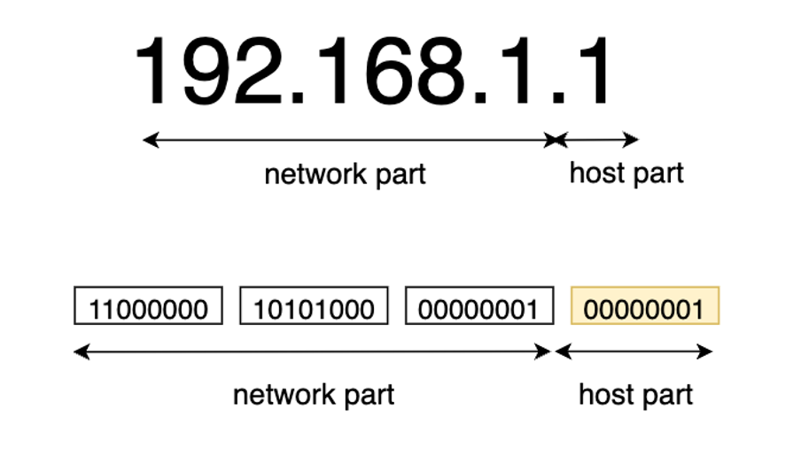

# 3. IP 주소 및 ARP 프로토콜

## IP 주소

TCP/IP 네트워크 모델 구조에서 컴퓨터를 식별하기 위해 사용하는 주소

- IPv4 vs IPv6
  - IPv4는 32 bit 주소 길이를 가지며, IPv6는 128 bit 주소 길이
  - 일반적으로 IPv4 환경 사용

### **IPv4 주소 체계**

- 0.0.0.0 부터 255.255.255.255 까지의 형태로 구성
  
- 네트워크 파트는 어떤 네트워크인지 알 수 있는 정보이고, 호스트 파트는 그 네트워크 안의 특정 컴퓨터 지칭

### 서브넷

- Sub Network의 줄임말로, 네트워크를 논리적으로 분할하여 세분화시킨 단위
- IP 주소의 낭비를 줄이고, 좀 더 효율적으로 할당하기 위해 제시
- 브로드캐스트 영역을 축소 → 부하 줄임

### 서브네팅

- 하나의 네트워크 대역의 IP를 Subnet으로 분할하는 작업
- net ID+ host ID였던 2단계 주소 체계를 net ID, subnet ID, host ID인 3단계 주소 체계로 바꿈
- 서브넷 마스크를 이용하여 net ID, subnet ID, host ID 구별

### 서브넷 마스크

- 네트워크 대역을 나눠주는데 사용하는 값
- 네트워크 대역을 어디서부터 구별할 건지에 대한 것
- 2진수로 표기했을 때 1로 시작, 1과 1사이에는 0이 올 수 없다는 규칙을 가짐
- 1하고 0이 나뉘는 부분이 쪼개는 곳임
  - 1이 있는 곳은 네트워크 대역을 구분, 0이 있는 곳은 그 하나의 네트워크 대역에 속해있는 컴퓨터들을 구분하는데 사용

## 공인 IP / 사설 IP

- 사설 IP
  - 같은 네트워크 대역에서 사용하는 IP 주소
- 공인 IP
  - 네트워크 통신망과 통신할 때 사용하는 IP 주소
- 사설 IP를 사용하고 있는 장비들이 통신할 때 무조건 공인 IP로 바꿔서 인터넷과 통신함
- NAT(Network Address Translation) = 사설 IP를 공인 IP로 바꿔주는 기술
- 외부에서는 사설 IP가 보이지 않는다!!
  - 실제 인터넷 세상에서는 공인 IP로만 통신하기 때문

## ARP 프로토콜

같은 네트워크 대역에서 통신을 하기 위해 필요한 MAC 주소를 IP 주소를 이용해서 알아오는 프로토콜

- 실제 통신은 MAC 주소를 통해 통신함. but 상대방의 IP 주소만 알고 통신을 시작함.
- IP는 유동적으로 계속 변할 수 있는 값이고, MAC 주소는 랜카드의 고유값이기 때문에 통신 도중에 고유한 값인 MAC을 통해 목적지를 확실하게 유지하기 위함

### 통신 과정

1. 출발지에서 ARP요청을 보냄
2. 이더넷 프로토콜을 encapsulation함
3. 프로토콜을 같은 대역대에 있는 모두에게 보냄 (모르기 때문)
4. 가운데에 있는 switch라는 2계층 장비가 2계층 프로토콜까지만 확인해서 decapsulation
5. 모두가 받아서 2계층 프로토콜 확인했을 때 모두이기 때문에 해당되서 3계층까지 까봄
6. 그렇다면 IP주소를 확인해서 일치하지 않으면 패킷 버리고 일치하는 애는 응답 프로토콜을 만들어서 줌
7. 응답을 받은 출발지에서 ARP캐시 테이블에 목적지의 MAC주소를 등록
